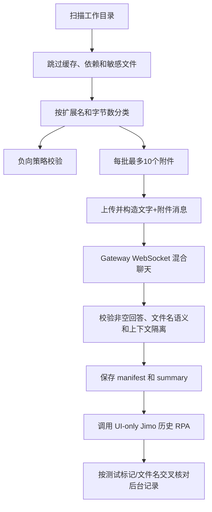

# 文件混合输入自动测试方案

## 目标

验证桌面端、Gateway、Agent、Jimo Provider 在“文字 + 本地附件”场景下的统一行为。测试输入根目录默认是：

当前仓库目录（命令默认从仓库根目录执行）

图床是受保护边界：测试可以验证图片经过现有图床链路，但不修改图床实现、配置或 API。

## 流程



## 命令

先运行本地门禁：

```powershell
pnpm test
pnpm lint
pnpm build
```

运行真实文件链路（显式 `--live` 才会调用 Jimo）：

```powershell
pnpm test:file-inputs -- --live `
  --root . `
  --max-requests 10 `
  --max-files 50 `
  --report-dir .tmp\yoomclaw-file-input-tests
```

运行 Electron UI 真实冒烟：

```powershell
pnpm test:file-inputs:ui -- --live `
  --report-dir .tmp\yoomclaw-file-input-tests
```

在已登录并开启 Chrome CDP 后，使用指定的 UI-RPA 读取后台历史：

```powershell
$env:NODE_PATH = 'packages\agent-core\node_modules'
pnpm test:file-inputs:history -- `
  --live-report .tmp\yoomclaw-file-input-tests\run-<id>\summary.json `
  --cdp http://127.0.0.1:9222 `
  --max-records 20

```

### Latest verification

- Local tests, lint and build: passed.
- Extension coverage: 18/18 (100%).
- UI smoke: passed, including frontend video-size rejection and the 10/11-file boundary.
- Live report `run-0Bni1f`: discovered=69164, selected=26, passed=5, failed=0, blocked=0; effective videos uploaded with HTTP 200 and over-limit videos returned `FILE_TOO_LARGE`.
- RPA gate: pending until a logged-in Chrome exposes CDP at `127.0.0.1:9222`.

`test:file-inputs:history` 只调用用户提供的
`web-automation/collect-jimo-history-rpa.mjs` 不会读取 Cookie、Token 或调用 Jimo 后台 API。

## 量化完成门槛

### 必须通过

1. 共享文件策略与前后端一致：最多 10 件；文档/图片 10 MB，音频 30 MB，视频有效上限 30 MB；不支持扩展名和超限文件必须在上传前拒绝。截图中的视频 120 MB 是原始展示值，但当前 Jimo 通过 base64 JSON 接收文件，实测 42.4 MB 原文件仍触发上游 413，因此前后端统一采用带传输余量的 30 MB 有效上限。
2. `acceptedExtensionCoverage >= 1`：扫描目录中实际存在的每种支持扩展名都至少被选中一次。
3. 10 件附件进入 Gateway，11 件返回 `TOO_MANY_FILES`，且第 11 件不触发 Agent。
4. 至少 1 次真实文字+附件混合请求成功，回答非空，且可见会话不包含 `agentContext` 或 `data:` 原始数据。
5. UI 冒烟通过：连接、文件选择、拖拽、超限视频前端拒绝、10/11 件边界、混合发送全部通过，错误列表为空。
6. 本地 `pnpm test`、`pnpm lint`、`pnpm build` 全部退出码为 0。
7. 受保护图床文件内容不变：
   - `packages/llm-provider/src/image-host.ts`
   - `packages/llm-provider/src/image-host.test.ts`

### 全部文件能力的额外门槛

真实测试报告中的 `failed` 和 `blocked` 必须为 0；有效上限以内的文件不得出现 `PROVIDER_FILE_TOO_LARGE`。超过 30 MB 的视频应由前端和 Gateway 在上传前统一返回 `FILE_TOO_LARGE`，不再把一个前端可选但 Jimo 必然拒绝的文件送到上游。

### 后台历史门槛

RPA 报告必须满足：

- `crossCheck.rpaCompleted = true`；
- `testMarkerFound = true` 或 `selectedFilenameFound = true`；
- `detailErrors = 0`。

## 当前审计结果

- 本地测试、Lint、构建：通过。
- 支持扩展覆盖率：18/18，100%。
- UI 真实冒烟：通过。
- 真实文件链路：上一次基线运行发现 100.6 MB 视频越过上游 413 限制；本次将其收敛为前后端一致的 `FILE_TOO_LARGE` 预检案例，需重新运行真实链路确认有效上限内无上游拒绝。
- RPA：脚本入口和交叉核对包装器已验证；当前机器的 `127.0.0.1:9222` 没有 Chrome CDP，因此后台历史门槛尚未满足。
### Latest verification
