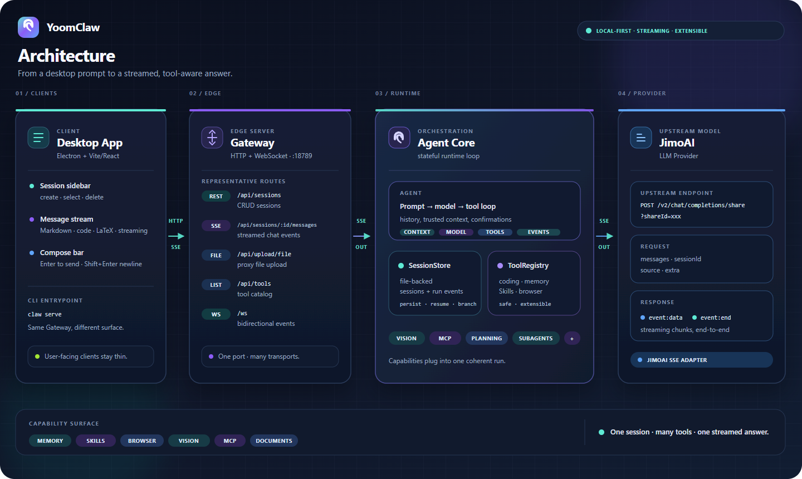

# YoomClaw

A mini OpenClaw-like personal AI agent framework, built from scratch.

Inspired by [OpenClaw](https://github.com/openclaw/openclaw) — the open-source personal AI assistant framework by Peter Steinberger.

## What is this?

YoomClaw is a minimal implementation of an OpenClaw-style AI assistant framework, including:

- **Gateway** — HTTP + WebSocket server that routes messages between UI and LLM
- **Agent Core** — Session management, tool registry, agent runtime loop
- **LLM Provider** — Pluggable provider abstraction (default: JimoAI SSE format)
- **Desktop App** — Electron + Vite/React chat interface (WebSocket transport, Markdown/LaTeX/code highlighting)
- **CLI** — Command-line entry point

## Architecture

<p align="center">
  
</p>

The request path is intentionally thin: clients talk to one local Gateway, the Agent Core owns state and tools, and the provider returns a streamed SSE response.

## Quick Start

### 1. Install dependencies

```bash
pnpm install
```

### 2. Configure environment

```bash
cp .env.example .env
# Edit .env with your JimoAI credentials
```

Required values:
- `JIMO_SHARE_ID` — from JimoAI platform > 服务发布 > API 接入
- `JIMO_AUTHORIZATION` — same place

### 3. Run in development

```bash
# Terminal 1: Gateway
pnpm dev:gateway

# Terminal 2: Desktop app (Electron + Vite renderer) — spawns Gateway internally
pnpm dev
```

Or both at once:

```bash
pnpm dev:all
```

The YoomClaw desktop window launches automatically (Electron spawns the Gateway). Start chatting.

### 4. Production build

```bash
pnpm build
pnpm start
```

## Project Structure

```
YoomClaw/
├── packages/
│   ├── protocol/         # Shared TypeScript types
│   ├── llm-provider/     # LLM adapter (JimoAI SSE format)
│   ├── agent-core/       # Session store, tool registry, agent loop
│   └── gateway/          # HTTP + WebSocket server
├── apps/
│   ├── cli/              # `claw` CLI entry
│   └── desktop/          # Electron app (main process + Vite/React renderer)
├── web-automation/       # Opt-in Chrome/Jimo history automation and probes
├── skills/               # Skill directory (extensible)
├── package.json
├── pnpm-workspace.yaml
└── tsconfig.base.json
```

## API Format

This project uses the JimoAI API format (see [api.md](./docs/api.md)):

- **Chat**: `POST /v2/chat/completions/share?shareId=xxx` with `Authorization` header
- **Request body**: `{ messages, sessionId, source, extra }`
- **Response**: SSE stream with `event: data` (content chunks) and `event: end` (stream end)
- **File upload**: `POST /v2/upload/file/share` with `{ url, source }`

## Extending

### Add a new tool

```typescript
import { DefaultToolRegistry } from "@yoomclaw/agent-core";

const registry = new DefaultToolRegistry();
registry.register({
  risk: "safe",
  definition: {
    name: "my_tool",
    description: "Does something useful",
    parameters: {
      type: "object",
      properties: { input: { type: "string" } },
      required: ["input"],
    },
  },
  async run(args, _context) {
    return { result: `Processed: ${String(args.input ?? "")}`, isError: false };
  },
});
```

### Add a new LLM provider

Implement the `LLMProvider` interface in `@yoomclaw/llm-provider` and register it in the factory.

## Hermes Mode

当前默认运行模式是 `Hermes Mode`：它保留现有积墨 AI 主 API 和 Jimo SSE 请求格式，在本地增加了可选工作区、文件优先会话、全局/项目提示词、长期记忆、Skills 草稿、编程工具、Chrome CDP 浏览器工具和主 Agent 的多模态输入。

唯一主 Agent 的配置与可复制到平台“主题”的静态提示词见 [`agents/main.md`](./agents/main.md)。

桌面端打开“设置 → Agent”即可：

- 选择项目工作区；工作区规则保存为项目根目录的 `AGENTS.md`。
- 编辑全局提示词、用户偏好和项目提示词。
- 开关 Toolsets，编辑记忆，批准或拒绝 Skills 草稿。
- 设置并连接已经用 `--remote-debugging-port=9222` 启动的 Chrome。

运行数据默认保存到 Electron 的 `<userData>/YoomClaw/`，包括 `prompts/`、`memories/`、`skills/`、`sessions/`、`browser/` 和 `logs/`。旧工作区中的 `.claw-data/sessions.json` 会被复制迁移为单会话文件，原文件不会删除。

积墨 API 不支持原生 `system` / `tools` / 客户端完整 history，因此 Hermes 首轮会把规则、记忆、项目提示词和工具说明拼进 user 内容；后续轮次只发送工具结果，并始终使用同一个 provider session id。当前只有一个主 Agent（默认模型标识为 `gpt-5.6-luna`）；图片仍必须先上传到图床，转换为 HTTPS URL 后随原始多模态消息交给主 Agent。

访问权限有三档：`请求批准`（编辑外部文件和使用互联网时始终询问）、`替我审批`（仅对检测到的风险操作请求批准）和 `完全访问权限`。完全访问会取消应用层的工作区、敏感路径和命令拦截，但仍使用当前 Windows 用户权限，不会自动提权。

当前可按 Toolset 开关的扩展工具包括：`update_plan`、`apply_patch`、`read_document`、`web_fetch` / `web_search`、`execute_code`、`parallel`、`delegate_task`、`tool_search` / MCP 调用、浏览器工具和 Windows `computer_use`。默认开启计划、文档、网页、代码和编排能力；MCP 与 Computer Use 默认关闭。MCP 当前通过 `YOOMCLAW_MCP_URL` 提供 HTTP JSON-RPC 连接，搜索通过 `YOOMCLAW_SEARCH_URL` 配置。

Office 文档使用本地无第三方依赖的解析 helper；旧版二进制 `.doc` / `.xls` 可能需要先转换为 `.docx` / `.xlsx`。浏览器控制使用 Chrome CDP；`computer_use` 使用独立的 Windows UI Automation helper，默认关闭且不可回退到浏览器。

验证命令：

```bash
pnpm -r --if-present lint
pnpm --dir apps/desktop/renderer run typecheck
pnpm --dir apps/desktop/renderer run build
pnpm test
```

完整的真实 Jimo + Electron UI + Chrome 历史测试流程见 [UI_E2E_TEST_PLAN.md](./UI_E2E_TEST_PLAN.md)。常用入口：

```bash
pnpm test:e2e:ui -- --live
pnpm test:e2e:ui -- --live --full-live
pnpm test:e2e:chrome-history -- --start-chrome --wait-for-login --live-report <summary.json>
pnpm test:e2e:history -- --live-report <summary.json> --rpa-script "web-automation/collect-jimo-history-rpa.mjs"
```

## Browser and Windows computer control

Browser tools now use Chrome CDP with tab selection, semantic targets, strict
single-element matching, accessibility snapshots, and sensitive-input blocking.
The separate `computer_use` tool uses a Windows UI Automation helper when
`YOOMCLAW_COMPUTER_ENABLED=true` and the helper is built. It never falls back to
browser control, arbitrary shell commands, global coordinate clicks, password
fields, or clipboard reads. Computer control is Windows-only and disabled by
default.

## License

MIT
